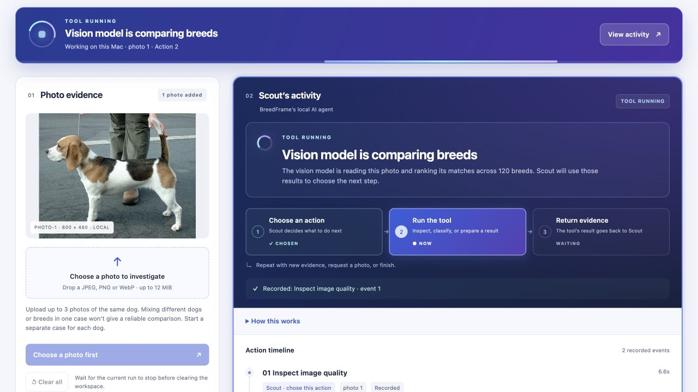
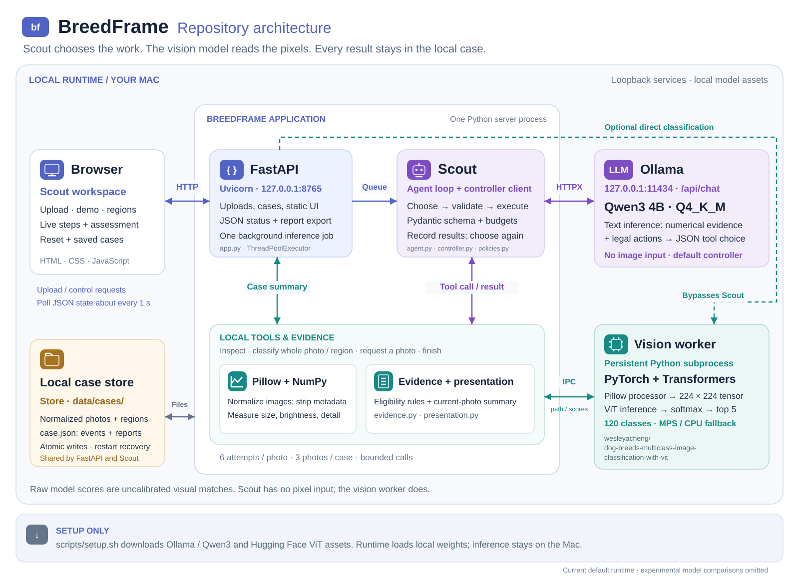
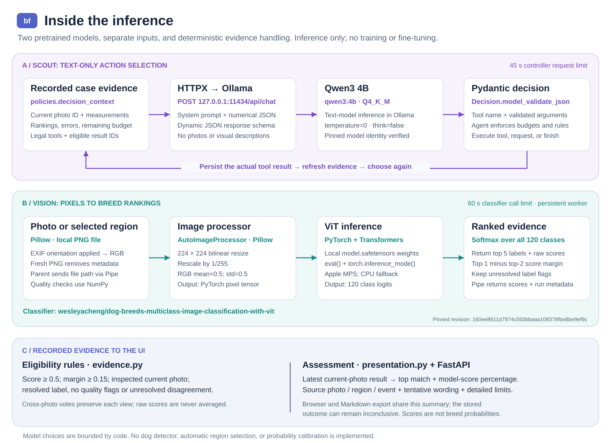

# BreedFrame

A local dog-photo investigation prototype. Meet **Scout**, the agent that chooses tools, collects their results, and decides what to do next. Qwen3 4B makes those choices from recorded numerical evidence; a separate Vision Transformer (ViT) reads the pixels and ranks visual breed matches.

**Prototype complete; model experiments closed.** The interface presents the top visual match and its model score, with tentative wording where appropriate. These scores are uncalibrated, and the reporting gate still blocks every classifier result in the recorded v2 corpus. Useful breed reporting missed the owner's coverage target in the final candidate comparison. [Findings, strengths and limits](docs/findings.md).

Built and exercised on an M4 MacBook Air with 16 GB memory. Scout's current workspace during a real local demo run:



[Using Scout](docs/usage.md) covers the current flow and assessment. [Screenshot provenance and historical captures](docs/screenshots/README.md) record which interface each image shows.

## Architecture

**FastAPI**, served by **Uvicorn** on `127.0.0.1:8765`, handles the browser, case operations, and background work. Scout runs in that Python application and calls **Ollama** on `127.0.0.1:11434` through **HTTPX**. A separate, persistent Python worker runs the ViT with **PyTorch** and **Transformers**. Photos, tool events, and reports stay in the local case store.



[Editable draw.io diagram, both pages](docs/diagrams/breedframe-architecture.drawio) · [Full-size architecture](docs/diagrams/breedframe-architecture.svg) · [Diagram notes and source references](docs/diagrams/README.md)

<details>
<summary>AI/ML inference detail: model inputs, preprocessing, scores, and assessment</summary>

Scout sends numerical observations and a constrained action schema to **Qwen3 4B Q4_K_M**. The separate image path uses **Pillow** preprocessing, a **224 × 224 tensor**, and the **120-class dog-breed ViT**. PyTorch computes softmax scores and returns the top 5 classes. Deterministic evidence and presentation code turn those recorded results into the assessment; neither model trains during use.



[Open the inference diagram at full size](docs/diagrams/breedframe-inference.svg). Model identities, libraries, and responsibilities are listed below.

</details>

## AI/ML stack

**BreedFrame runs two pretrained models locally:** a Vision Transformer (ViT) ranks dog-breed images, and Qwen3 chooses the next investigation action from the recorded numerical evidence. The application uses the models for inference; it doesn't train or fine-tune them.

| Tool or model | What it does in BreedFrame |
|---|---|
| **PyTorch (`torch`)** | Runs the ViT, converts its outputs to softmax scores, and selects the top 5 classes. Uses Apple's Metal Performance Shaders (MPS) backend on supported Macs, with a CPU fallback. |
| **Hugging Face Transformers (`transformers`)** | Loads the image processor and ViT through `AutoImageProcessor` and `AutoModelForImageClassification`. Prepares each image as a 224×224 input tensor for PyTorch. |
| **Dog-breed ViT** | The pretrained `wesleyacheng/dog-breeds-multiclass-image-classification-with-vit` model supplies rankings across 120 classes for a whole photo or user-selected region. Its scores are uncalibrated visual matches. |
| **Scout / Qwen3 4B Q4_K_M** | Scout is the agent's UI name. Its default text-only language model chooses whether to inspect, classify, request another photo, or finish. It receives numerical observations and case state; it has no image input. |
| **Ollama** | Runs Qwen3 locally and exposes the `/api/chat` endpoint used by the controller. Requests constrain the response to a JSON action schema. |
| **Pillow (`PIL`)** | Decodes uploads, applies EXIF orientation, converts images to RGB, and re-encodes them without metadata. The classifier explicitly selects Transformers' Pillow preprocessing backend (`backend="pil"`). |
| **NumPy (`numpy`)** | Calculates brightness and pixel-detail measurements for image-quality flags. These are fixed numerical heuristics. |
| **Torchvision (`torchvision`)** | Provides vision support used by the installed Transformers package and is an explicit project dependency. The application's selected preprocessing backend is Pillow. |
| **Hugging Face Hub (`huggingface_hub`) and Safetensors (`safetensors`)** | Setup downloads a pinned classifier revision with the Hub client. Transformers loads the local `model.safetensors` weights; classifier inference uses local files only. |

A **tensor** here is a multidimensional array of numbers, such as the processed image pixels passed to PyTorch. TensorFlow isn't used in this repository.

The surrounding workflow is custom Python: [the agent loop](breedframe/agent.py) executes actions, [Pydantic contracts](breedframe/contracts.py) validate arguments, and deterministic [evidence rules](breedframe/evidence.py) decide whether rankings qualify for a report. FastAPI exposes the local application, and HTTPX connects the controller to Ollama.

See the [classifier implementation](breedframe/classifier.py), [controller implementation](breedframe/controller.py), and [image diagnostics](breedframe/images.py) for the inference paths. Dependency constraints are in [pyproject.toml](pyproject.toml), exact resolved Python versions are in [uv.lock](uv.lock), and [Accuracy, models and data](#accuracy-models-and-data) records model identities and limitations.

## Run it

Requires Apple Silicon macOS, Python 3.11 and [uv](https://docs.astral.sh/uv/getting-started/installation/). Run these commands from the repository root:

```sh
sh scripts/setup.sh
sh scripts/start.sh
```

**First run:** let setup finish before starting the app. **Later sessions:** run only `sh scripts/start.sh` and keep its terminal open. See the [local model setup and troubleshooting guide](docs/setup.md) for model locations, port conflicts, and download recovery.

Open [BreedFrame on localhost](http://127.0.0.1:8765). Setup downloads the locked Python dependencies, Ollama 0.34.0, Qwen3 4B Q4_K_M (about 2.5 GB), the ViT (about 344 MB), and the attributed demonstration/evaluation photos. Allow several GB of disk space for the runtime, dependencies and caches.

Setup uses a project-local model directory. If another Ollama server occupies port 11434 with a different model, setup stops with instructions instead of replacing it. Start uses the reviewed model digest; it never pulls weights. On macOS, newly started Ollama and the application run under a policy that denies outbound networking except loopback. An already running Ollama server keeps its existing process policy.

Ctrl-C stops processes launched by the start script. Case state remains in `data/cases/`. The local page has no external fonts, scripts, analytics or inference calls. Attribution links open external pages only when you follow them.

If either model is unavailable, the page shows which component needs setup and disables Scout’s inference controls until readiness is confirmed. Use **Check again** after setup; saved cases remain accessible while the app server is reachable.

## Investigate a photo with Scout

1. Start with the empty workspace. Choose or drop a dog photo, then submit it. **Try a demo photo** starts a real local run with the full-resolution or low-resolution Beagle photo; nothing is loaded automatically.
2. Follow **Scout’s activity**. The live banner names the current work, and the step cards show **Choose an action → Run the tool → Return evidence**. The action timeline records actual results. Expand **How this works** for the AI/ML roles or **Inspect input & result** for an event's details.
3. Read **Assessment** for the current photo's top visual match, model score, and source. Low or closely ranked scores remain tentative. **Notes and assessment details** explains the reporting limits; model scores aren't probabilities of breed identity.
4. Add up to **3 photos of the same dog**, one at a time, including after an assessment completes. Mixing different dogs or breeds in one case won't give a reliable comparison. Use **Start a separate case** for another dog. A new photo has no match until it has its own classification result.
5. Use **Clear all** to return to an empty workspace. Previous results remain in **Saved cases**, where you can reopen them. **Clear saved cases** permanently deletes that store's cases, photos, and reports after confirmation. Wait for active work to stop before resetting or deleting.

[Using Scout](docs/usage.md) also covers region selection, direct classification, cancellation, retry, and downloads. The controller can finish without requesting another photo or classifying an added view. Those choices remain visible; the original request/resume demonstration is preserved in the [historical evaluation](docs/evaluation.md).

For a real CLI run while Ollama is running:

```sh
make demo
PYTHONPATH=. .venv/bin/python scripts/run_case.py data/demo/beagle.jpg
```

The CLI prints a case ID. Use `--resume CASE_ID` with another photo to continue. CLI, scripted demo and evaluation cases use separate directories under `data/`. Run inference experiments sequentially when comparing timings.

## What is agentic here?

The controller can inspect the image, classify the whole photo, classify a user-selected region, request another photo, or finish. When no result is eligible, the schema constrains the finish outcome to inconclusive; the model retains the choice among other allowed actions. A shared legal-action schema and runtime validators enforce supported arguments, evidence references, six attempts and 240 seconds per photo, and three photos per case. Selecting a region explicitly requires one attempt to classify it; autonomous whole-photo and follow-up choices remain with the controller.

Scout has no image input. Inspection supplies pixel diagnostics and the classifier supplies rankings. Deterministic comparison combines actual observations across photos, counts each photo once per candidate, and retains raw scores per observation without averaging them. Weak scores, unresolved labels, quality concerns and conflicting leading classes prevent an eligible breed report. The presentation layer can still show a tentative top visual match from the latest classification of the current photo. These are uncalibrated reporting heuristics and do not detect dogs. [Comparison policy and historical evidence](docs/evidence-comparison.md).

A persistent child process loads the ViT on MPS, with a CPU fallback. The parent can terminate it after a timeout. JSON case writes are atomic; interrupted runs become incomplete on restart. The plain browser frontend polls a FastAPI service bound to loopback. [Spec](docs/spec.md) · [Architecture decision](docs/adr/001-local-inference.md) · [Failure and evaluation details](docs/evaluation.md).

## Measured results

The new [20-photo corpus](docs/photo-set-v2.md) contains 13 cases, split by identity into six development and seven reserved cases before inference. Three policies use the same normalized inputs and classifier: direct classification, deterministic rules, and Qwen3. Both orchestration policies share the same tool opportunities and conservative reporting boundary.

Reserved-case results, with follow-ups supplied only when requested:

| Measure | Direct raw ranking | Direct with same gate, replay | Rules | Qwen3 |
|---|---:|---:|---:|---:|
| Correct leading outputs / all eligible dogs | 3 / 4 | 0 / 4 | 0 / 4 | 0 / 4 |
| Cases with no eligible output | 0 / 7 | 7 / 7 | 7 / 7 | 7 / 7 |
| Follow-up photos used | 0 | — | 4 | 0 |
| Breed outputs on the horse control | 1 / 1 | 0 / 1 | 0 / 1 | 0 / 1 |
| Breed outputs on the multi-dog case without selection | 1 / 1 | 0 / 1 | 0 / 1 | 0 / 1 |
| Mean elapsed time, warm models | 0.153 s | — | 0.276 s | 10.589 s |

The direct arm originally exposed an ungated ranking; rules and Qwen3 exposed gated reports. The replay applies the same numerical gate to the recorded initial direct outputs, with no new inference or workflow timing. The maximum ViT score in this corpus is 0.222815, below the 0.5 floor, so every gated arm must withhold these outputs. The original 3/4 versus 0/4 comparison does not isolate orchestration quality.

No tool or controller errors occurred. The rules policy requested further photos on all cases; seven requests exhausted the available fixtures and were explicitly closed with user-style partial reports. Qwen3 completed all cases inconclusive without requesting more photos. Zero false reports here accompanies zero breed-report coverage; it does not establish dog detection.

Supplying both photos regardless of policy improved one reserved direct-classifier result and regressed another, leaving 3/4 correct. Qwen3 inspected but skipped classification of every added photo. A separate three-photo crop pilot changed one correct prediction to an incorrect one. Its two small crops and one modest framing change do not assess cropping for subject separation or establish its general usefulness.

The [full comparison](docs/evidence-comparison.md) includes development results, frozen source hashes, complete traces, costs and limits. These public archive photos are a small convenience sample with unknown training overlap. The [original five-input evaluation and memory measurements](docs/evaluation.md) remain historical evidence; their prompt and reporting policy differ from this version.

## Accuracy, models and data

Rankings offer candidate **visual breed matches** among 120 known classes. They are uncalibrated model outputs, not genetic ancestry percentages. Multiple candidates are alternatives, not a breed mixture. An unfamiliar breed or non-dog can still receive a leading match.

- **Classifier:** [wesleyacheng/dog-breeds-multiclass-image-classification-with-vit](https://huggingface.co/wesleyacheng/dog-breeds-multiclass-image-classification-with-vit), revision `160ee8611d7974c550bbaaa108378fbe8be9ef9c`. The model card declares MIT. It describes fine-tuning Google's ViT on Stanford Dogs; training-image rights remain separate.
- **Controller:** [Qwen3 4B Q4_K_M](https://ollama.com/library/qwen3:4b), Apache 2.0, served by [Ollama](https://github.com/ollama/ollama). The reviewed model digest is enforced by the startup check.
- **Processor:** pinned `AutoImageProcessor`, 224×224 bilinear resize, rescale by 1/255, RGB mean/std 0.5. EXIF orientation is applied before re-encoding uploads without metadata.
- **Labels:** exact published class indices are preserved. `curly`, `wire`, `soft`, `flat`, `shih`, `black`, and `german_short` remain unresolved labels. The original pre-truncation training mapping could not be retrieved; no names were guessed. [Verification record](docs/evidence/model-verification.json).
- **Photos:** the beagle demo and pug evaluation image are by sannse, CC BY-SA 3.0. Golden Retriever Carlos is by Dirk Vorderstraße, CC BY 2.0. The 48×32 derivatives retain their source license. [Attributions and download hashes](docs/evidence/image-provenance.json). Screenshots containing the beagle photo retain its attribution and CC BY-SA 3.0 terms for that image.

Images, models, case traces, dependencies and caches live in ignored directories. Only explicitly curated public demo/evaluation evidence is included in `docs/evidence/`. Local case files are private by default permissions but are not encrypted. This is a single-user localhost demo, not a service to expose on a network.

## Verify and develop

GitHub Actions runs the repository checks on pull requests and updates to public `main`, using locked dependencies and no model-weight downloads. CodeQL and dependency security alerts complement these software checks; model experiments remain closed.

```sh
make check
.venv/bin/python scripts/fetch_photo_set.py --check-only
PYTHONPATH=. .venv/bin/python scripts/evaluate_pairs.py --split development --mode policy --output data/my-paired-results.json
```

`make check` synchronizes the locked dependencies, then runs tests, Ruff, JavaScript syntax checks and agent-flow state tests. Required classifier tests use the real processor and production worker with tiny generated weights; they need no downloaded model assets. Other tests cover comparison, region provenance, partial reports, cancellation, deadlines, retry budgets and HTTP boundaries using named fake models. Browser and CLI investigations use Qwen3. The evaluation's `rules` method is explicitly deterministic. Paired and crop runners refuse to overwrite existing outputs; use a new path to record another run. The older `make evaluate` command retains its single-photo protocol and overwrites its historical output, so preserve that file before using it.

[Development and reproducibility](docs/development.md) covers storage, offline checks and runtime limits. Historical experiments use the [measured-source archive](docs/evidence/frozen-sources/README.md); publication formatting is separate from their registered source bytes. The [Qwen3.5 controller comparison](docs/model-comparison-results.md) records the separate model trial and explicit local model-selection commands.

The completed [classifier audit](docs/classifier-audit.md), [ResNet screen](docs/classifier-screen.md), [context probe](docs/current-photo-context.md), [paired controls](docs/paired-suitability-results.md) and [new-identity comparison](docs/identity-comparison-results.md) are preserved as experiment history. The last comparison produced 0/6 supported-case reports from each candidate. ResNet, two-photo agreement and the context change were not adopted; the conditional vision screen did not run. The [findings page](docs/findings.md) closes these investigations and records the condition for reopening model work.

The code is [MIT licensed](LICENSE); third-party models and images retain their own licenses. The prototype is [published on GitHub](https://github.com/lilabrooks/breedframe). See [third-party notices](THIRD_PARTY_NOTICES.md) and the [security policy](SECURITY.md).
