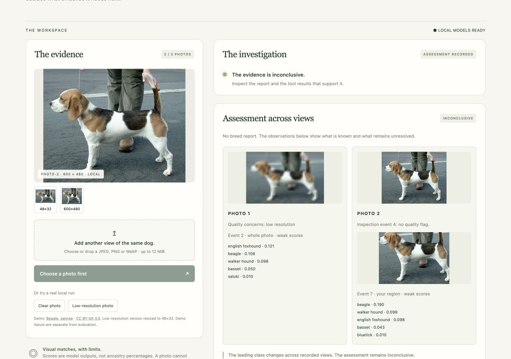
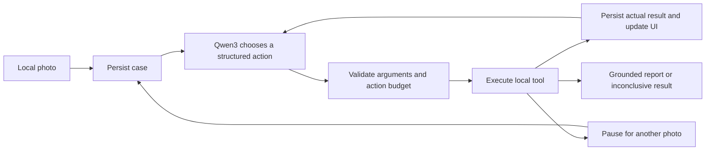

# BreedFrame

A local dog-photo investigation prototype for experimentation with model-controlled workflows. Qwen3 4B chooses tools from numerical evidence; a separate ViT supplies raw breed rankings. The UI records the work and explains why a report is blocked.

**Prototype complete; model experiments closed.** The current reporting gate blocks every recorded v2 classifier result. Useful breed reporting missed the owner's coverage target in the final candidate comparison. The implementation demonstrates local inference, bounded actions and persistent evidence; no reliable breed-report operating range was established. [Findings, strengths and limits](docs/findings.md).

Built and exercised on an M4 MacBook Air with 16 GB memory. The screenshot below records the v2 interface before the final wording update.



## Run it

Requires Apple Silicon macOS, Python 3.11 and [uv](https://docs.astral.sh/uv/getting-started/installation/). Run these commands from the repository root:

```sh
sh scripts/setup.sh
sh scripts/start.sh
```

Open [BreedFrame on localhost](http://127.0.0.1:8765). Setup downloads the locked Python dependencies, Ollama 0.34.0, Qwen3 4B Q4_K_M (about 2.5 GB), the ViT (about 344 MB), and the attributed demonstration/evaluation photos. Allow several GB of disk space for the runtime, dependencies and caches.

Setup uses a project-local model directory. If another Ollama server occupies port 11434 with a different model, setup stops with instructions instead of replacing it. Start uses the reviewed model digest; it never pulls weights. On macOS, newly started Ollama and the application run under a policy that denies outbound networking except loopback. An already running Ollama server keeps its existing process policy.

Ctrl-C stops processes launched by the start script. Case state remains in `data/cases/`. The local page has no external fonts, scripts, analytics or inference calls. Attribution links open external pages only when you follow them.

## Explore the recorded investigation

1. Click **Clear photo** or upload a dog photograph. The status and assessment appear before the expandable execution record. Expect an inconclusive assessment under the measured configuration; inspect the raw rankings and blockers to understand it.
2. Add another view to the same case, even after a completed assessment. Earlier reports remain in the JSON history. Each classified view keeps its own scores; disagreement blocks a breed report.
3. Open **Select a dog region**, draw a box or enter its bounds, then click **Analyze selected region**. This explicitly requests a classifier call on your selected pixels. A crop shares its parent photo's evidence and consumes the remaining action budget.
4. Explore case recovery: cancel a running investigation, retry remaining actions after interruption, download a readable assessment, or delete an inactive case. The request/resume control was demonstrated under v1 and the deterministic policy. If a request occurs, supply another photo or choose **I can’t provide another photo**; Qwen3 did not request one in the measured v2 policy runs.
5. Use **Compare with direct classification** for a single ViT call on the current whole photo.

These controls perform real local work. The controller can finish inconclusive without requesting a follow-up. In the current measured runs, it also inspected but did not classify an added photograph. The UI shows that missing evidence; it does not invent a comparison. The original request/resume demonstration remains in the [historical evaluation](docs/evaluation.md).

For a real CLI run while Ollama is running:

```sh
make demo
PYTHONPATH=. .venv/bin/python scripts/run_case.py data/demo/beagle.jpg
```

The CLI prints a case ID. Use `--resume CASE_ID` with another photo to continue. CLI, scripted demo and evaluation cases use separate directories under `data/`. Run inference experiments sequentially when comparing timings.

## What is agentic here?



The controller can inspect the image, classify the whole photo, classify a user-selected region, request another photo, or finish. When no result is eligible, the schema constrains the finish outcome to inconclusive; the model retains the choice among other allowed actions. A shared legal-action schema and runtime validators enforce supported arguments, evidence references, six attempts and 240 seconds per photo, and three photos per case. Selecting a region explicitly requires one attempt to classify it; autonomous whole-photo and follow-up choices remain with the controller.

The text controller has no image input. Inspection supplies pixel diagnostics and the classifier supplies rankings. Deterministic comparison combines actual observations across photos, counts each photo once per candidate, and retains raw scores per observation without averaging them. Weak scores, unresolved labels, quality concerns and conflicting leading classes prevent an eligible breed report. These are uncalibrated reporting heuristics and do not detect dogs. [Comparison policy and current evidence](docs/evidence-comparison.md).

A persistent child process loads the ViT on MPS, with a CPU fallback. The parent can terminate it after a timeout. JSON case writes are atomic; interrupted runs become incomplete on restart. The plain browser frontend polls a FastAPI service bound to loopback. [Spec](docs/spec.md) · [Architecture decision](docs/adr/001-local-inference.md) · [Failure and evaluation details](docs/evaluation.md).

## Measured results

The new [20-photo corpus](docs/photo-set-v2.md) contains 13 cases, split by identity into six development and seven reserved cases before inference. Three policies use the same normalized inputs and classifier: direct classification, deterministic rules, and Qwen3. Both orchestration policies share the same tool opportunities and conservative reporting boundary.

Reserved-case results, with follow-ups supplied only when requested:

| Measure | Direct raw ranking | Direct with same gate, replay | Rules | Qwen3 |
|---|---:|---:|---:|---:|
| Correct leading outputs / all eligible dogs | 3 / 4 | 0 / 4 | 0 / 4 | 0 / 4 |
| Cases with no eligible output | 0 / 7 | 7 / 7 | 7 / 7 | 7 / 7 |
| Follow-up photos used | 0 | — | 4 | 0 |
| Breed outputs on the horse control | 1 / 1 | 0 / 1 | 0 / 1 | 0 / 1 |
| Breed outputs on the multi-dog case without selection | 1 / 1 | 0 / 1 | 0 / 1 | 0 / 1 |
| Mean elapsed time, warm models | 0.153 s | — | 0.276 s | 10.589 s |

The direct arm originally exposed an ungated ranking; rules and Qwen3 exposed gated reports. The replay applies the same numerical gate to the recorded initial direct outputs, with no new inference or workflow timing. The maximum ViT score in this corpus is 0.222815, below the 0.5 floor, so every gated arm must withhold these outputs. The original 3/4 versus 0/4 comparison does not isolate orchestration quality.

No tool or controller errors occurred. The rules policy requested further photos on all cases; seven requests exhausted the available fixtures and were explicitly closed with user-style partial reports. Qwen3 completed all cases inconclusive without requesting more photos. Zero false reports here accompanies zero breed-report coverage; it does not establish dog detection.

Supplying both photos regardless of policy improved one reserved direct-classifier result and regressed another, leaving 3/4 correct. Qwen3 inspected but skipped classification of every added photo. A separate three-photo crop pilot changed one correct prediction to an incorrect one. Its two small crops and one modest framing change do not assess cropping for subject separation or establish its general usefulness.

The [full comparison](docs/evidence-comparison.md) includes development results, frozen source hashes, complete traces, costs and limits. These public archive photos are a small convenience sample with unknown training overlap. The [original five-input evaluation and memory measurements](docs/evaluation.md) remain historical evidence; their prompt and reporting policy differ from this version.

## Accuracy, models and data

Rankings offer candidate **visual breed matches** among 120 known classes. They are uncalibrated model outputs, not genetic ancestry percentages. Multiple candidates are alternatives, not a breed mixture. An unfamiliar breed or non-dog can still receive a leading match.

- **Classifier:** [wesleyacheng/dog-breeds-multiclass-image-classification-with-vit](https://huggingface.co/wesleyacheng/dog-breeds-multiclass-image-classification-with-vit), revision `160ee8611d7974c550bbaaa108378fbe8be9ef9c`. The model card declares MIT. It describes fine-tuning Google's ViT on Stanford Dogs; training-image rights remain separate.
- **Controller:** [Qwen3 4B Q4_K_M](https://ollama.com/library/qwen3:4b), Apache 2.0, served by [Ollama](https://github.com/ollama/ollama). The reviewed model digest is enforced by the startup check.
- **Processor:** pinned `AutoImageProcessor`, 224×224 bilinear resize, rescale by 1/255, RGB mean/std 0.5. EXIF orientation is applied before re-encoding uploads without metadata.
- **Labels:** exact published class indices are preserved. `curly`, `wire`, `soft`, `flat`, `shih`, `black`, and `german_short` remain unresolved labels. The original pre-truncation training mapping could not be retrieved; no names were guessed. [Verification record](docs/evidence/model-verification.json).
- **Photos:** the beagle demo and pug evaluation image are by sannse, CC BY-SA 3.0. Golden Retriever Carlos is by Dirk Vorderstraße, CC BY 2.0. The 48×32 derivatives retain their source license. [Attributions and download hashes](docs/evidence/image-provenance.json). Screenshots containing the beagle photo retain its attribution and CC BY-SA 3.0 terms for that image.

Images, models, case traces, dependencies and caches live in ignored directories. Only explicitly curated public demo/evaluation evidence is included in `docs/evidence/`. Local case files are private by default permissions but are not encrypted. This is a single-user localhost demo, not a service to expose on a network.

## Verify and develop

GitHub Actions runs the repository checks on pull requests and updates to public `main`, using locked dependencies and no model-weight downloads. CodeQL and dependency security alerts complement these software checks; model experiments remain closed.

```sh
make check
.venv/bin/python scripts/fetch_photo_set.py --check-only
PYTHONPATH=. .venv/bin/python scripts/evaluate_pairs.py --split development --mode policy --output data/my-paired-results.json
```

`make check` runs tests, Ruff and JavaScript syntax checks. Tests cover comparison, region provenance, partial reports, cancellation, deadlines, retry budgets and HTTP boundaries using named fake models. Browser and CLI investigations use Qwen3. The evaluation's `rules` method is explicitly deterministic. Paired and crop runners refuse to overwrite existing outputs; use a new path to record another run. The older `make evaluate` command retains its single-photo protocol and overwrites its historical output, so preserve that file before using it.

[Development and reproducibility](docs/development.md) covers storage, offline checks and runtime limits. Historical experiments use the [measured-source archive](docs/evidence/frozen-sources/README.md); publication formatting is separate from their registered source bytes. The [Qwen3.5 controller comparison](docs/model-comparison-results.md) records the separate model trial and explicit local model-selection commands.

The completed [classifier audit](docs/classifier-audit.md), [ResNet screen](docs/classifier-screen.md), [context probe](docs/current-photo-context.md), [paired controls](docs/paired-suitability-results.md) and [new-identity comparison](docs/identity-comparison-results.md) are preserved as experiment history. The last comparison produced 0/6 supported-case reports from each candidate. ResNet, two-photo agreement and the context change were not adopted; the conditional vision screen did not run. The [findings page](docs/findings.md) closes these investigations and records the condition for reopening model work.

The code is [MIT licensed](LICENSE); third-party models and images retain their own licenses. The prototype is [published on GitHub](https://github.com/lilabrooks/breedframe). See [third-party notices](THIRD_PARTY_NOTICES.md) and the [security policy](SECURITY.md).
