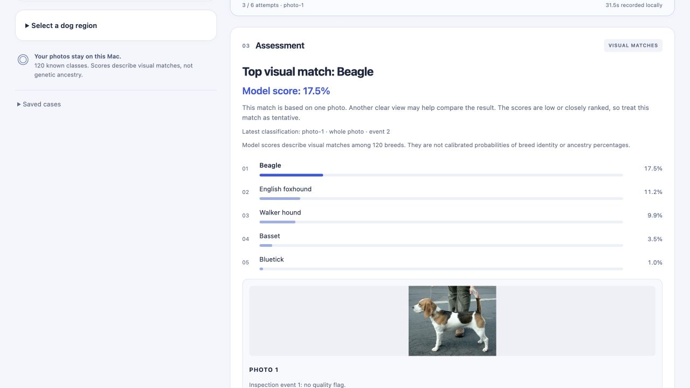

# Using Scout

Scout is BreedFrame's local investigation agent. Its language model chooses actions from recorded measurements and rankings. A separate vision model reads the photo. Open the local app after following the [setup instructions](setup.md).

If Scout’s local models aren’t ready, a visible setup panel identifies the missing component and explains how to start it. New investigations and inference actions stay disabled until both models are available. Choose **Check again** after setup; the page also rechecks automatically. You can still reopen saved cases while the app server is reachable.

## Start with a photo

The workspace starts empty. Choose or drop a JPEG, PNG, or WebP image, then use the upload button to begin. Each file can be up to 12 MiB. **Try a demo photo** provides full-resolution and low-resolution versions of the public Beagle photo; either button starts real local work.

Add up to **3 photos of the same dog**, one at a time. Another angle can provide additional evidence. Mixing photos of different dogs or breeds in one case won't give a reliable comparison, so use **Start a separate case** for each dog. The photo badge counts photos already added; you don't need all 3 to begin.

## Follow the investigation

**Scout’s activity** shows the repeating loop:

1. **Choose an action:** Scout reads the recorded evidence and selects a permitted tool.
2. **Run the tool:** image checks measure size, brightness, and detail; the Vision Transformer ranks matches across 120 breed classes; assessment code assembles the recorded results.
3. **Return evidence:** the tool's result becomes available for Scout's next choice. Scout can continue, request another photo, or finish.

The live banner names the current work and stays visible as you scroll. **View activity** returns to the step cards. Action counts reflect attempts within the per-photo budget, rather than a percentage-complete estimate. Motion respects the system's reduced-motion preference.

The action timeline records which action ran, who chose it, its result, and timing. Expand **Inspect input & result** for the recorded inputs, outputs, and model metadata. **How this works** explains the division between Scout, pixel-quality checks, the vision model, and assessment code. These explanations describe the workflow; they don't expose hidden model reasoning.

## Read the assessment

When the current photo has been classified, **Assessment** starts with its top visual match and model score. The pictured demo returned Beagle at 17.5%. That number describes the model's output across its known classes; it isn't a calibrated probability that the dog is a Beagle, or an ancestry percentage.

This is a current UI capture from a real local demo on 2026-09-12. [Capture details and photo attribution](screenshots/README.md).

Low or closely ranked scores receive tentative wording. Alternative breeds are competing matches, not components of a breed mixture. The source line identifies the photo, whole image or selected region, and event used for the summary.

Expand **Notes and assessment details** for uncertainty and the underlying reporting outcome, and **Ranking history across photos** for earlier results. The reporting gate is unchanged: a visible tentative match can accompany an internally `inconclusive` outcome. The [findings](findings.md) retain the measured limitations.

Adding a follow-up photo starts a new assessment with the earlier evidence retained. Until that photo is classified, the UI says it has no classification result. If recorded views disagree, the summary identifies the latest result and explains the disagreement. Scout may inspect a follow-up and finish without classifying it; another photo doesn't guarantee another ranking.

## Start over or manage saved cases

| Control | Effect |
|---|---|
| **Clear all** | Returns to an empty workspace, with no default dog photo. Saved cases remain available. |
| **Start a separate case** | Starts an empty workspace for another dog while keeping previous cases. |
| **Saved cases** | Expands the local history so you can reopen a case and its assessment. Collapsed by default. |
| **Delete this case** | Permanently deletes the current inactive case and its stored photos and reports after confirmation. |
| **Clear saved cases** | Permanently deletes all cases in the browser store, including the current saved case, after confirmation. This also removes their photos and reports. |

Reset and deletion controls wait for active work to stop. **Clear saved cases** applies to the whole browser store, including entries beyond the displayed recent list. CLI and evaluation stores are separate. There is no undo for deletion.

## Continue, inspect a region, or recover

- **Follow-up requests:** supply another view of the same dog when Scout asks. If you can't, use **I can’t provide another photo** to close the stopped case with its available evidence. Completed cases can also accept another photo within the limit.
- **Regions:** expand **Select a dog region**, draw a box or enter percentage bounds, then choose **Analyze selected region**. This requests classification of your selected pixels. BreedFrame doesn't detect or select the dog for you. One region is allowed per photo and uses its remaining action budget.
- **Direct comparison:** **Compare with direct classification** makes a separate vision-model call on the current whole photo. It doesn't establish that either path is accurate.
- **Cancellation and retry:** **Cancel investigation** waits for the current bounded call to return and retains completed observations. Where offered, **Retry remaining actions** keeps the attempts and time already consumed. A connection-loss message means progress can't currently be confirmed; reconnect before deciding what to do next.
- **Downloads:** **Download assessment** exports the readable summary and its evidence. **Open execution record** exposes the saved JSON case and events.

The default budget is 6 attempts and 240 seconds per photo. See [development and runtime limits](development.md#runtime-limits) for failure handling and storage details.
